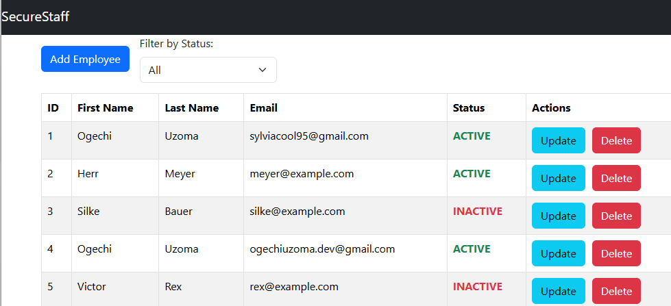
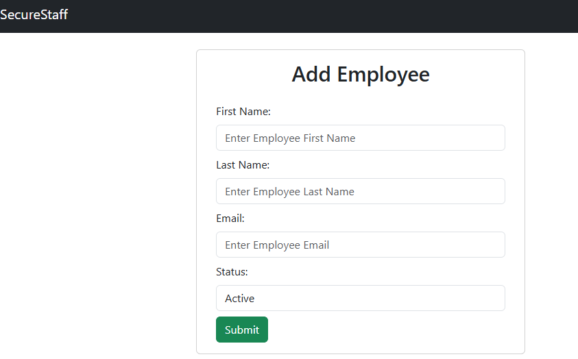

# SecureStaff – Employee Management System
SecureStaff is a full-stack employee management application developed using React, Spring Boot, PostgreSQL and Docker. The application allows users to manage employee records through a modern web interface connected to a RESTful backend API.

## Features
- Add new employees
- View all employees
- Update employee information
- Delete employees
- Employee status filtering
- Employee status management using Java Enums
- REST API integration
- PostgreSQL database integration
- Responsive frontend UI
- Cloud deployment with Render

---

## Tech Stack
### Frontend
- React
- Vite
- Axios
- Bootstrap
- React Router DOM

### Backend
- Java 21
- Spring Boot
- Spring Data JPA
- Maven
- Lombok

### Database
- PostgreSQL

### Deployment
- Docker
- Render

---

## Architecture
The application follows a monolithic full-stack architecture.

The backend is built using the MVC pattern with:
- Controller layer
- Service layer
- Repository layer

Frontend and backend communicate through REST APIs.

```text
React Frontend → REST API → Spring Boot Backend → PostgreSQL Database
```

---

## REST API Endpoints
| Method |       Endpoint        |    Description    |
|--------|-----------------------|-------------------|
| GET    | `/api/employees`      | Get all employees |
| GET    | `/api/employees/{id}` | Get employee by ID|
| POST   | `/api/employees`      | Create employee   |
| PUT    | `/api/employees/{id}` | Update employee   |
| DELETE | `/api/employees/{id}` | Delete employee   |
---

## Live Demo
### Frontend
https://securestaff-employee-management-frontend.onrender.com

### Backend API
https://securestaff-employee-management.onrender.com/api/employees

---

## Local Setup

### Clone Repository
```bash
git clone https://github.com/sylviacool/securestaff-employee-management.git
```

---

### Backend Setup
```bash
cd backend
mvn clean install
mvn spring-boot:run
```
Backend runs on:
```text
http://localhost:8080
```

---

### Frontend Setup
```bash
cd frontend
npm install
npm run dev
```
Frontend runs on:
```text
http://localhost:3000
```

---

## Environment Variables
Frontend:
```env
VITE_API_BASE_URL=http://localhost:8080/api/employees
```

Backend database configuration:
```properties
spring.datasource.url=
spring.datasource.username=
spring.datasource.password=
```

---

## Future Improvements
- Authentication & Authorization
- Role-based access control
- Employee search
- Pagination
- File upload support
- Dashboard analytics

---

## Application Preview
### Employee Dashboard


### Add Employee Form


---

## Author
Ogechi Sylvia Uzoma